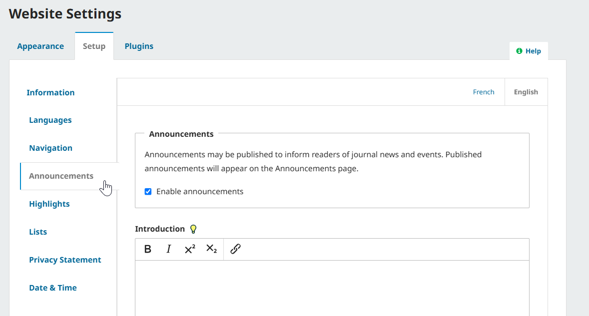
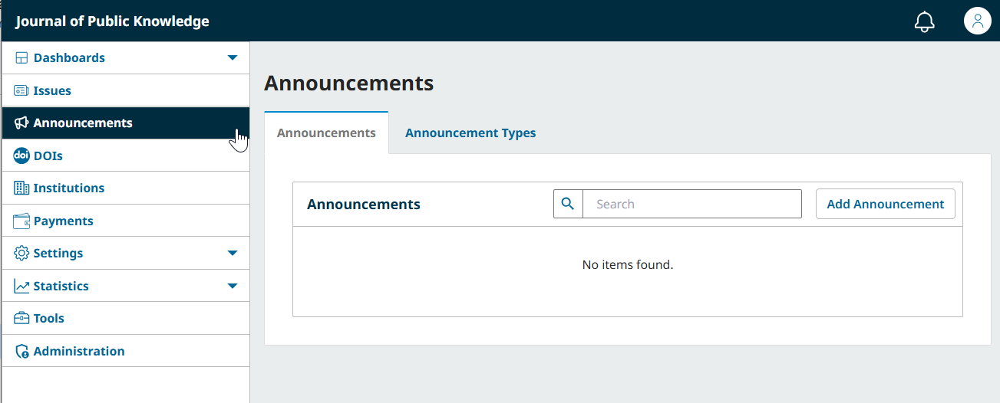
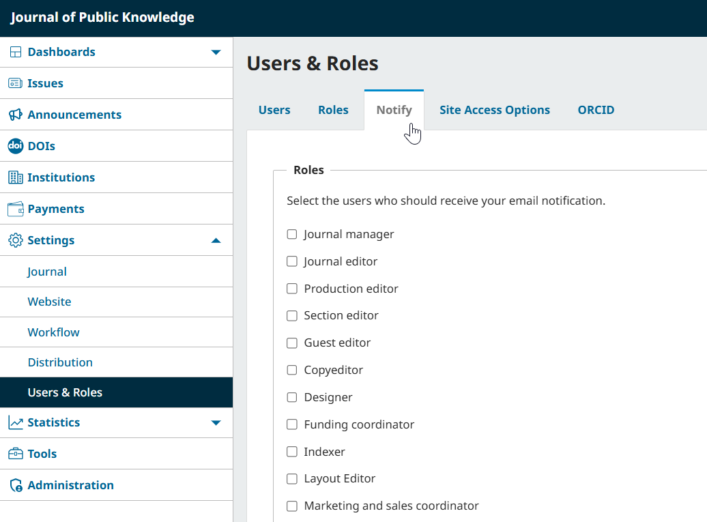
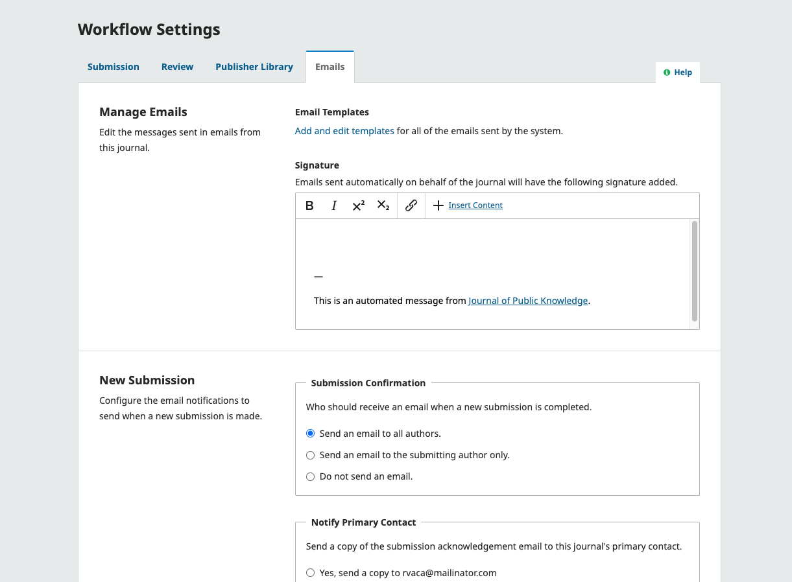
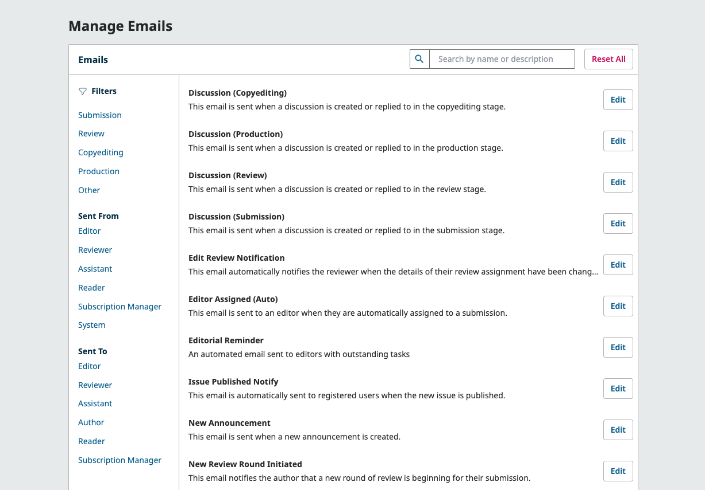
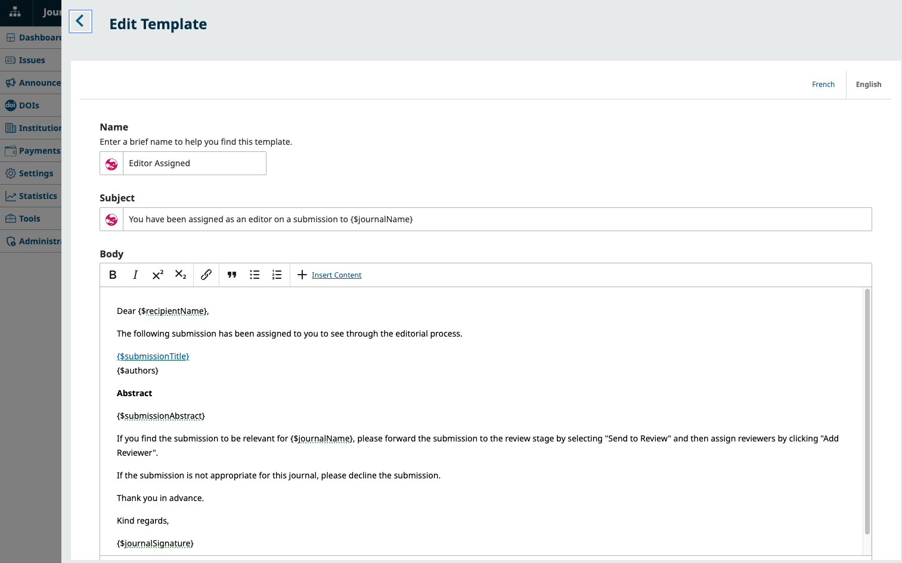
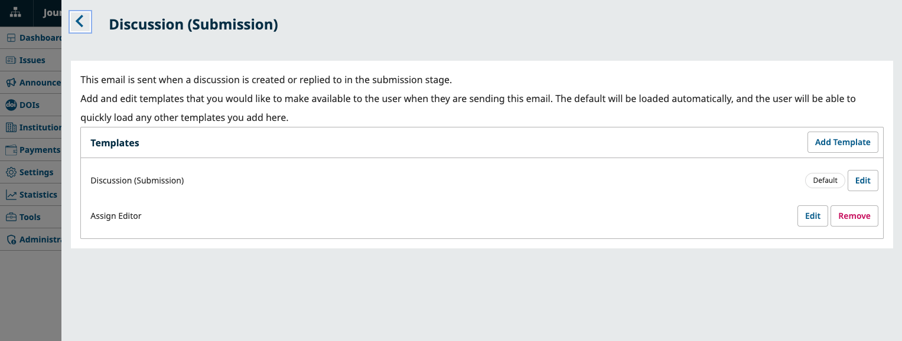

# Communications: Manage Emails and Announcements
In order to communicate with users, OJS makes extensive use of email templates and also offers a few ways to contact multiple users at once: announcements and bulk emails by role. In this chapter, you will learn how to configure, edit, and use these types of communications.

## Configure and Make Announcements {#announcements}

Announcements are a way to share communications with all users on the site. In addition to being published on your journal site, you can also opt to notify users whenever you make a new announcement.

This PKP School video explains how to configure Announcements in OJS. To watch other videos in this series, visit [PKP’s YouTube channel](https://www.youtube.com/playlist?list=PLg358gdRUrDVTXpuGXiMgETgnIouWoWaY).



### Enable Announcements {#enable-announcements}

To enable and configure announcements, visit the “Setup” tab in Website Announcements and go to the “Announcements” section.

Click “Enable announcements” to turn announcements on or off. When enabled, this will add an Announcements menu to the sidebar and reveal the configuration options below.

  - **Introduction**: Enter any general information you would like to appear on your announcements page.
  - **Display on Homepage**: Enter the number of announcements to be displayed on the homepage. If this is left blank, no announcements will be displayed.

Once you are done, click Save.

### Make an Announcement {#make-announcements}

Once you’ve enabled announcements, you will have access to the Announcements menu from your sidebar.

Click on Announcements and click the "Add Announcement" button. Here you can include the title of the announcement, a short description and / or full text of the announcement, and an (optional) expiry date. 

You can fill out the following fields:
- **Title**: The title of your announcement.
- **Short Description**: A short description of the announcement. This will appear on the list of announcements.
- **Announcement**: The full text of the announcement. Users can click the title of the announcement to access a separate page with the full announcement.
- **Image**: Attach a relevant image to your announcement. Drag your image into the outlined area or use the “Upload Image” button to select an image.
- **Expiry Date**: The announcement will stop displaying after the specified date. Leave blank to make an announcement permanent.
- **Send Email**: Click the checkbox to send an email notification to all users who have not opted out of email notifications. This option only works when sending a new announcement, and will not work if checked when editing a previously published announcement.

The announcement will appear in the list, with options to View, Edit, and Delete. The announcement will also appear on the "Announcements" tab of your journal’s site.

> Note: The “Announcement Types” tab is not currently used by OJS and can be safely ignored.
{:.tip}

## Send Email Notifications to All Users with a Specific Role {#bulk-emails}

> Email configuration must be completed by a system administrator in order for the system to send emails to users. See the [Administrator's Guide](https://docs.pkp.sfu.ca/admin-guide/en/deploy-email) for more information. Furthermore, the Site Administrator must also enable bulk emails for your journal. See [Learning OJS for Site Administrators](https://docs.pkp.sfu.ca/learning-ojs/3.5/site-admin/en/#bulk-emails) for detailed instructions.
{:.warning}

In addition to announcements, you can also contact multiple users using bulk emails. Bulk emails are emails sent to all users registered to the specified role(s). For example, you might use this feature to send an email to all Journal Managers, or an email to all Section Editors and Guest Editors.

Under the Settings menu, select Users & Roles, then choose the Notify tab. This tab will **not appear** if the Site Administrator has not enabled bulk emails.

In the Notify tab, select the user roles that you would like to email, enter a subject and email message, and then choose if you wish to send a copy of the email to your own email address. Click Save, then confirm by clicking Send Email.

You will receive a status notification indicating that the message was successfully queued to be sent.

## Configure and Customize Automated Emails {#email-templates}

> Email configuration must be completed by a system administrator in order for the system to send automated emails to users. See the [Administrator's Guide](https://docs.pkp.sfu.ca/admin-guide/en/deploy-email) for more information.
{:.warning}

OJS facilitates communication with users at various stages throughout the workflow with prepared email messages. From the Emails tab of the Workflow Settings, you can configure various settings related to when emails are sent, as well as the content of the emails sent.

This PKP School video explains how to configure emails in OJS. To watch other videos in this series, visit [PKP’s YouTube channel](https://www.youtube.com/playlist?list=PLg358gdRUrDVTXpuGXiMgETgnIouWoWaY).



### Configure Email Settings {#email-config}

The Emails tab of the Workflow Settings allows you to configure the emails that are sent out from the system. You can also access all email templates by clicking **Add and edit templates**. 

**Signature**: The information in this field will be added to the bottom of every email sent out by the system.

**New Submission**: Configure which contacts should receive the submission confirmation email (all authors, submitting author, or no authors) and submission acknowledgement email (primary contact, none, and/or any additional contacts specified in the “Notify Anyone” field).

**Editorial Decisions**: Configure which authors should receive the decision emails (all authors or just the submitting author).

**For Editors**: Configure whether monthly statistics updates should be sent to all users with an Editorial role. Individual Editors can unsubscribe from this email from their user profile.

**Advanced: Bounce Address**: A notice will be sent to this email address of any system-sent emails that fail to deliver, such as when the targeted email address is no longer valid.

### Manage Email Templates {#email-templates}

Click  **Add and edit templates** in the Emails tab of the Workflow settings screen to access the list of prepared email templates. Here, you can view and modify the templates. The title and summary of each email template is displayed in the list.

You can search for an email template by keyword using the **Search** box.

**Filters** are also available to help find templates by workflow stage, sender (sent from), or recipient (sent to). 

#### Edit Email Templates {#edit-templates}

When you click the Edit button for a template, you’ll find that some templates can only be edited, while some will allow you to create additional templates. 

Emails that are typically sent automatically or tied to a specific event (e.g., Notify Other Authors) can only be edited.

For emails that are sent manually (e.g., Discussion (Copyediting)), you can both edit and create additional templates. 

Click the Add Template or Edit button beside an existing template to create an additional template or make changes.

> OJS does not currently support email attachments for automated emails. You can share files by uploading them to the [Publisher Library](./other-tools#publisher-library) and sharing the URL.
{:.tip}

Use the  “Insert Content” button to add variables to your email text. Variables are placeholders for information that will change depending on the situation, such as author name, submission title.

For example, an email containing the recipient name and submission title variables will appear like this in the template:
“Dear {$recipientName}, thank you for submitting your article titled {$submissionTitle}.”

When the template is used to send an email, the variables are replaced with the relevant information, e.g.
“Dear Bob, thank you for submitting your article titled Scholarly Associations Use of OJS for Publication.”

> The option to “Remove” a template will only appear for user-created email templates and templates that do not have the “Default” Label.
{:.warning}

#### Restore Default Email Templates {#restore-default-emails}

If you want to revert all email template changes and restore templates to the system default, click the “Reset All” button.

> This action will also delete any user-created templates, and cannot be reversed.
{:.warning}
